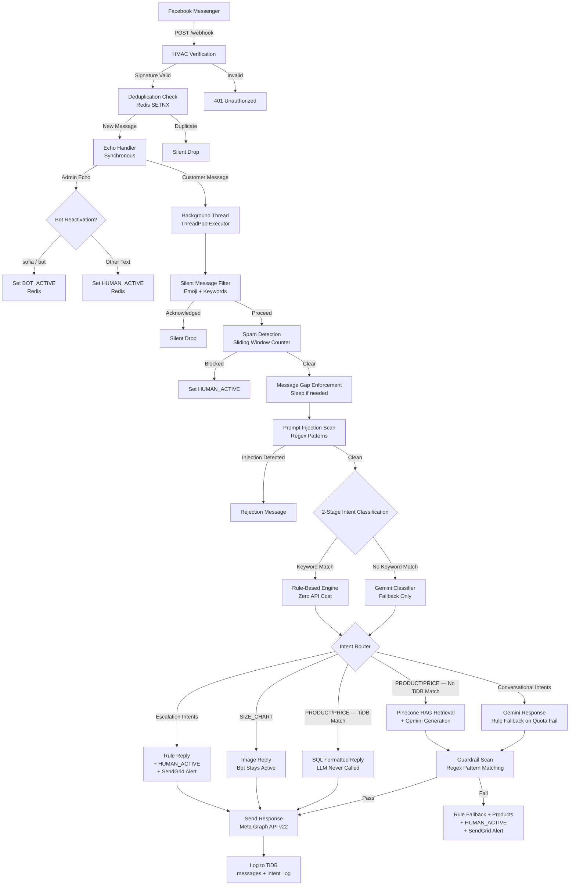

<div align="center">
 
# **SOFIA** — AI-Powered Facebook Messenger Chatbot

**S**afe **O**utput, **F**ulfillment & **I**ntent **A**nalysis

[](https://python.org)
[](https://flask.palletsprojects.com)
[](https://ai.google.dev)
[](https://pinecone.io)
[](https://redis.io)
[](https://render.com)
[](tests/)
[](https://developers.facebook.com)

**A cost-controlled hybrid LLM system where conversation is AI-driven and product responses are deterministic to eliminate hallucination for critical product data**

</div>
 
---
 
## What It Does
 
- Handles real customer inquiries for Ace Apparel on Facebook Messenger — product lookup, purchase routing, and escalation — fully automated
- Automates human handover for purchase, complaint, refund, wholesale, and shipping intents with a single deterministic reply and an admin alert
- Enforces a database-first architecture for product queries — LLMs never generate product facts when structured data exists, and are tightly constrained via RAG when it does not

---

## Design Decisions

- **Multi-path execution model** — LLM handles queries unrelated to product data, deterministic logic handles product and escalation paths, while rule-based fallbacks guarantee responses under failure conditions and when Gemini API daily token limit is reached
- **RAG-based product retrieval via Pinecone** — when TiDB returns no match, the customer message is embedded and the three closest product vectors are retrieved by cosine similarity; Gemini receives only retrieved context and is instructed to use nothing outside it
- **Production-grade reliability** — guardrail engine blocks hallucinated prices, fabricated SKUs, and false certainty language before delivery; any failure triggers immediate human handover, Redis-backed deduplication handles Meta's at-least-once delivery, and a sliding window spam detector prevents API cost explosion

---

## Quick Start

**Prerequisites:** Python 3.11+, Redis instance (local or Upstash), Meta Developer account, TiDB Cloud account, SendGrid account, Google Gemini API key

### Step 1 — Local Setup

```bash
# Clone and install
git clone https://github.com/Lawrenze09/SOFIA-Messenger-Bot.git
cd SOFIA-Messenger-Bot
python -m venv .venv
source .venv/bin/activate     # macOS / Linux
.venv\Scripts\activate        # Windows
pip install -r requirements.txt

# Configure environment
cp .env.example .env          # macOS / Linux
copy .env.example .env        # Windows
# Edit .env — all required variables must be set before the server starts

# Run the server
python -m app.main
```

See [.env.example](.env.example) for the full variable list or the Environment Variables section below.

### Step 2 — Messenger Integration (optional)

```bash
# Expose local server
ngrok http 5001

# Meta Developer Dashboard → Your App → Webhooks → Edit
# Callback URL: https://<your-ngrok-url>/webhook
# Verify Token:  value of VERIFY_TOKEN in your .env
```

### Step 3 — Test the pipeline locally (no Meta required)

```bash
# Simulate a customer message through the full processing pipeline
curl -X POST http://localhost:5001/simulate \
  -H "Content-Type: application/json" \
  -d '{"message": "magkano yung hoodie?"}'

# Returns intent, response, and guardrail failure status as JSON
# Disabled automatically in production
```

---

## How It Works

**Hybrid Logic**

- `SMALL_TALK` / `PLAYFUL` / `BANTER` / `UNKNOWN` → Primarily handled by Gemini with rule-based engine as fallback when Gemini API reaches token limit
- `PRODUCT_INQUIRY` / `PRICE_QUERY` → If customer query on TiDB → return deterministic SQL reply, LLM never called; if not on TiDB → Gemini + Pinecone RAG with strict context injection response
- `PURCHASE` / `COMPLAINT` / `REFUND` / `WHOLESALE` / `SHIPPING` → one rule-based reply, bot pauses, SendGrid admin alert fires immediately

**Guardrails**

- All AI-generated responses pass through a regex guardrail scan — fabricated PHP prices, invented SKUs, false certainty language, and unsafe content are blocked before delivery
- Any guardrail failure → human handover + HUMAN_ACTIVE state + admin alert — never a silent failure
- Prompt injection patterns detected via regex scan before any text reaches Gemini

**Reliability / Production Constraints**

- Gemini timeout or quota exhaustion → rule-based safe fallback returned, bot stays operational
- Redis SETNX deduplication handles Meta's at-least-once delivery guarantee — same message ID never processed twice
- Admin replies from Page Inbox trigger HUMAN_ACTIVE — bot pauses immediately and only resumes when admin types 'sofia' or 'bot'

---

## System Architecture

The flow below represents a single inbound Messenger message from HMAC verification through intent routing to logged response delivery.



---

## Project Structure

```
sofia-bot/
│
├── app/                          # Webhook entry point & request routing
│   ├── __init__.py
│   ├── main.py                   # Flask factory, startup checks, Gunicorn hook
│   └── routes.py                 # 12-step message processing pipeline
│
├── assets/
│   └── size-chart-boxer.jpg      # SIZE_CHART intent image asset
│
├── config/
│   ├── __init__.py
│   └── settings.py               # Frozen dataclass — validated at startup
│
├── core/                         # Brain — all response logic
│   ├── __init__.py               # Public API for routes.py
│   ├── guardrails.py             # Regex engine — 4 failure categories
│   ├── intent_classifier.py      # Keyword dict → Gemini 2-stage classifier
│   └── sofia_agent.py            # Hybrid router: rule engine + RAG + guardrails
│
├── database/                     # Data persistence
│   ├── __init__.py               # Public API — repository functions only
│   ├── client.py                 # pymysql factory, TiDB SSL parsing
│   ├── models.py                 # DDL — sessions, messages, intent_log
│   └── repository.py             # All SQL — no queries outside this file
│
├── scripts/
│   ├── reset_session.py          # Emergency Redis session reset by PSID
│   └── sync_products.py          # TiDB → Pinecone product sync
│
├── services/                     # External API integrations
│   ├── email_service.py          # SendGrid — rate-limited admin alerts
│   ├── llm_service.py            # Gemini — classify, generate, embed
│   ├── messenger_service.py      # Meta Graph API — text and image send
│   ├── rag_service.py            # Pinecone — cosine similarity product retrieval
│   └── session_service.py        # Redis — session state, spam detection, rate limiting
│
├── tests/                        # 100% offline — no API keys required
│   ├── test_agent.py             # Handover routing, rule engine, AI fallback
│   ├── test_guardrails.py        # All 4 failure categories
│   ├── test_intent.py            # Keyword priority, Gemini fallback mock
│   └── test_security.py          # HMAC verification, injection detection, deduplication, silent filter
│
├── utils/
│   ├── __init__.py
│   ├── logger.py                 # Structured stdout logging
│   └── security.py               # HMAC, injection, dedup, silent filter
│
├── .env.example                  # All required and optional environment variables
├── .gitignore
├── LICENSE                       # Apache License 2.0
├── README.md                     # Project documentation
├── gunicorn.conf.py              # 2 workers, post_fork startup hook
├── render.yaml                   # Render Blueprint — Singapore region
└── requirements.txt
```

---

## Tech Stack

| Technology             | Purpose                                                         |
| :--------------------- | :-------------------------------------------------------------- |
| Python 3.11 + Flask    | Webhook server, request lifecycle, background thread dispatch   |
| Gunicorn               | Production WSGI — post_fork hook re-initializes services        |
| Google Gemini 2.5 Lite | Intent classification fallback + conversational generation      |
| Gemini Embedding 001   | 3072-dim vectors for Pinecone product indexing                  |
| Pinecone               | Cosine similarity retrieval — RAG context for unmatched queries |
| TiDB Cloud             | Serverless MySQL — product catalog, messages, intent analytics  |
| Upstash Redis          | Idempotency keys, session state, spam counter, rate limiting    |
| Meta Graph API v22     | Inbound webhook events + outbound message delivery              |
| SendGrid               | Per-user rate-limited admin alerts on escalation                |
| Render                 | Git-based deploy — Singapore region, free SSL, health checks    |
| pytest + unittest.mock | Offline test suite — all external services mocked               |

---

## Testing

- **99 tests, all passing, fully offline** — Gemini, Pinecone, TiDB, and Redis are mocked via `unittest.mock.patch`; no API keys required to run the suite
- **Meta App Review approved** — passed Facebook's platform policy and data handling review; live in production handling real customer inquiries for Ace Apparel
- **Regression guards in place** — `test_purchase_before_product_inquiry` pins keyword priority order; `test_handover_replies_map_is_complete` guards against incomplete handover routing

```bash
pip install pytest
pytest tests/ -v
```

---

## Deployment

```bash
# Render Blueprint (recommended) — push render.yaml → Render Dashboard → New → Blueprint

# Manual — Render Dashboard → New Web Service
# Build:  pip install -r requirements.txt
# Start:  gunicorn "app.main:create_app()" --config gunicorn.conf.py
# Region: Singapore

# Secret file — Render Dashboard → Environment → Secret Files
# Path: /etc/secrets/isrgrootx1.pem  (TiDB SSL certificate)

# Post-deploy — sync product catalog to Pinecone
python scripts/sync_products.py
```

---

## API Endpoints

| Method | Endpoint             | Auth         | Description                                    |
| :----- | :------------------- | :----------- | :--------------------------------------------- |
| `GET`  | `/webhook`           | VERIFY_TOKEN | Facebook webhook challenge verification        |
| `POST` | `/webhook`           | HMAC-SHA256  | Receive and process Messenger events           |
| `POST` | `/simulate`          | None         | Test pipeline locally — disabled in production |
| `GET`  | `/health`            | None         | Redis + MySQL connectivity check               |
| `POST` | `/reset/<psid>`      | None         | Emergency session reset for a user             |
| `GET`  | `/analytics/monthly` | None         | Intent distribution report                     |

---

## Environment Variables

**Meta**

| Variable            | Description                                  | Required |
| :------------------ | :------------------------------------------- | :------- |
| `META_APP_SECRET`   | Facebook App Secret for HMAC verification    | ✅       |
| `META_APP_ID`       | Facebook App ID — filters Sofia's own echoes | ✅       |
| `PAGE_ACCESS_TOKEN` | Facebook Page permanent access token         | ✅       |
| `VERIFY_TOKEN`      | Webhook verification token                   | ✅       |

**Gemini**

| Variable         | Description           | Required |
| :--------------- | :-------------------- | :------- |
| `GEMINI_API_KEY` | Google Gemini API key | ✅       |

**Database**

| Variable    | Description                               | Required |
| :---------- | :---------------------------------------- | :------- |
| `MYSQL_URI` | TiDB connection string with SSL cert path | ✅       |

**Redis**

| Variable    | Description              | Required |
| :---------- | :----------------------- | :------- |
| `REDIS_URL` | Upstash Redis connection | ✅       |

**Notifications**

| Variable           | Description                        | Required |
| :----------------- | :--------------------------------- | :------- |
| `SENDGRID_API_KEY` | SendGrid API key for admin alerts  | ✅       |
| `ADMIN_EMAIL`      | Recipient address for alert emails | ✅       |

**Pinecone**

| Variable           | Description                                | Required |
| :----------------- | :----------------------------------------- | :------- |
| `PINECONE_API_KEY` | Pinecone API key — RAG disabled if missing | ⚪       |
| `PINECONE_INDEX`   | Pinecone index name                        | ⚪       |

**App**

| Variable    | Description                                                  | Required |
| :---------- | :----------------------------------------------------------- | :------- |
| `FLASK_ENV` | Controls rate limiter storage URI — does not affect security | ⚪       |

---

## Author

Built by **Nazh Lawrenze Romero**

- LinkedIn: [Lawrenze Romero](https://www.linkedin.com/in/lawrenze-romero-6b6871378/)
- Live: [Ace Apparel on Facebook](https://www.facebook.com/profile.php?id=61579918910576) — message the page to interact with Sofia in production
